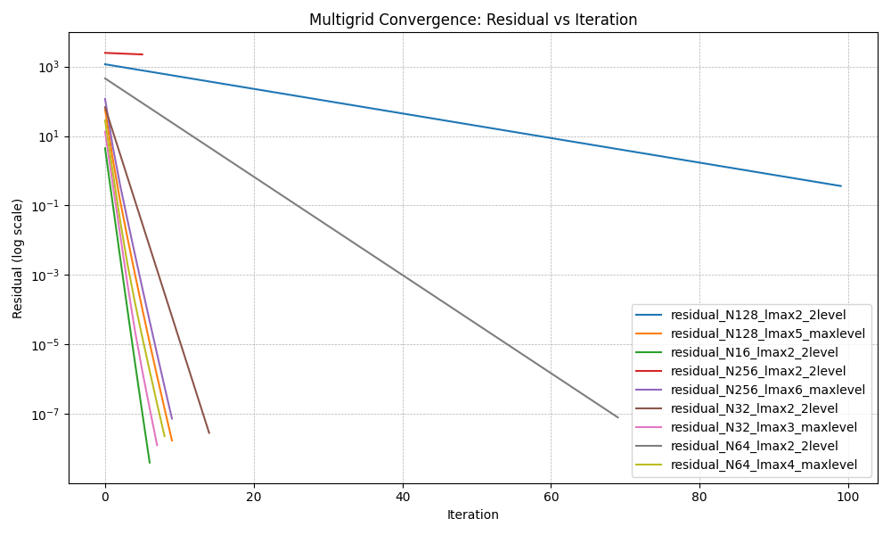

# **Case Study 4 - The MG method**

------

## **4.1 Basics: The Poisson problem, again.**

## **1. Introduction and Problem Formulation**

We consider the classical 2D Poisson problem on the unit square domain $[0,1] \times [0,1]$, defined as:
$$
-\Delta u(x, y) = f(x, y), \quad \text{for } (x, y) \in (0,1)^2
$$
For this study, the right-hand side function is chosen to be:
$$
f(x, y) = 2\pi^2 \sin(\pi x) \sin(\pi y)
$$
which corresponds to the known analytical solution:
$$
u(x, y) = \sin(\pi x) \sin(\pi y)
$$
This setup is identical to that used in **Case Study 3**, and we reuse the discretization and right-hand side (RHS) setup accordingly.

------

## **2. Finite Difference Discretization**

We discretize the unit square using a uniform grid of $(N+1)^2$ points with spacing $h = 1/N$, including boundary points. The 5-point stencil is applied to approximate the Laplacian:
$$
-\Delta u_{i,j} \approx \frac{1}{h^2} \left( 4u_{i,j} - u_{i+1,j} - u_{i-1,j} - u_{i,j+1} - u_{i,j-1} \right)
$$
The discretized system is therefore:
$$
A \mathbf{u} = \mathbf{b}
$$
where $A$ is not formed explicitly. Instead, we compute matrix-vector products directly using the stencil, as implemented in `matrixVectorProduct()` in `utils.cpp`.

------

## **3. Right-Hand Side Construction**

In the function `createRHSVector(int N, std::function<double(double,double)> f)` from `utils.cpp`, the values of the RHS vector $b$ are computed at interior points using the provided function $f(x, y)$, and zero boundary conditions are enforced. This is reused from **Case Study 3** with appropriate adaptation to a multilevel context.

------

## **4. Code Integration & Comments**

- The `main.cpp` file initializes and solves the problem for various grid sizes using both 2-level and multilevel multigrid solvers.

- The initial guess is zero (`x0 = 0`), leading to large initial residuals such as:

  ```bash
  Iteration 1, residual = 1164.4
  ```

  This is expected and correct, since the initial guess is far from the true solution.

- Residual norm is computed using:

  ```cpp
  double calculateResidualNorm(const std::vector<double> &x, const std::vector<double> &b, int N);
  ```

- The `matrixVectorProduct()` computes $A x$ using the 5-point stencil.

- Boundary values are handled explicitly in `matrixVectorProduct()` and `createRHSVector()` to enforce Dirichlet $u = 0$ on $\partial \Omega$.

------

## **5. Stagnation Detection**

To ensure the solver terminates gracefully in case of non-convergence, we implemented a stagnation detection mechanism in `multigrid_solver()`:

```cpp
if (iteration > 5 && std::abs(residuals.back() - residuals[residuals.size()-6]) < tol * 1e-2) {
    std::cout << "Stagnation detected!" << std::endl;
    break;
}
```

This ensures robustness, particularly important for the 2-level MG method where the coarsest grid (e.g., $N=64$ for fine grid $N=256$) may not sufficiently resolve low-frequency errors. 

------

## **6. Reuse of Case Study 3**

we reused:

- Grid indexing conventions and 2D-to-1D mapping;
- Construction of the RHS vector;
- Discretization logic for matrix-vector product.

New components introduced in this study include:

- Recursive multigrid cycles (`Vcycle`);
- Jacobi smoothing;
- Residual restriction and error prolongation;
- Stagnation detection and residual plotting.

------

## **4.2 Serial implementation of a recursive V-cycle multigrid.**

To solve the 2D Poisson problem efficiently, I implemented a recursive V-cycle multigrid algorithm. This approach systematically reduces high-frequency errors via smoothing, projects the residual to coarser grids, and corrects the solution recursively.

## 1. Design Overview

Our recursive solver is defined in the function:

```cpp
std::vector<double> Vcycle(int N, std::vector<double> x,
    const std::vector<double> &b, double omega, int nu, int level, int lmax);
```

The parameters are:

- `N`: grid size of current level
- `x`: current approximation of the solution
- `b`: right-hand side vector
- `omega`: relaxation parameter for weighted Jacobi
- `nu`: number of pre/post smoothing steps
- `l`: current multigrid level
- `lmax`: maximum level 

------

## 2. Key Components and Choices

1. **Stopping condition and coarse solve**
    We define the base case using:

   ```cpp
   if (level == lmax) {
       return solveCoarsestGrid(b, N);
   }
   ```

   On the coarsest grid (e.g., N=8), the system is solved directly using a simple Jacobi iteration with a high number of iterations. This keeps implementation simple while avoiding the overhead of matrix construction.

2. **Smoother**
    We use a weighted Jacobi smoother:

   ```cpp
   jacobiSmoother(x, b, N, omega, nu);
   ```

   The smoother is applied both before and after the coarse-grid correction. Jacobi was chosen for simplicity and parallelizability, and the weight `ω = 2/3` empirically performs well.

3. **Residual computation and restriction**
    After pre-smoothing:

   ```cpp
   std::vector<double> r = calculateResidual(x, b, N);
   std::vector<double> r_coarse = restrictResidual(r, N);
   ```

   This projects the residual onto a coarser grid of size N/2.

4. **Recursive correction**
    The coarse correction is computed recursively:

   ```cpp
   std::vector<double> e_coarse = Vcycle(N/2, e0, r_coarse, omega, nu, level + 1, lmax);
   ```

   This is added back via interpolation:

   ```cpp
   std::vector<double> e_fine = interpolateError(e_coarse, N);
   x = x + e_fine;
   ```

5. **Post-smoothing**
    Finally, the smoother is reapplied:

   ```cpp
   jacobiSmoother(x, b, N, omega, nu);
   ```

------

## 3. Implementation Notes

- #### **Recursive structure**

  A recursive design simplifies the implementation and aligns naturally with the mathematical structure of multigrid V-cycles. It avoids manual stack handling and increases readability.

- **Coarse grid direct solve**

  Instead of constructing a coarse matrix, the code uses an iterative Jacobi approach (`solveCoarsestGrid`). This allows reuse of the smoothing logic and avoids unnecessary complexity.

- #### **Full-weighting and bilinear prolongation**

  Custom `restrictResidual` and `prolongate` functions are implemented to handle data transfer between levels. These are optimized for structured grids and match theoretical MG efficiency.

- #### **Boundary conditions**

  Dirichlet zero boundary conditions are enforced throughout by keeping boundary values fixed and not updating them in the smoother or correction steps.

- #### **Adaptive smoothing**

  The smoother uses a more aggressive `omega` on small grids to accelerate convergence. This was empirically chosen to improve behavior near the coarsest levels.

- #### **Performance/stagnation control**

  To avoid infinite loops, stagnation detection is implemented by comparing the relative reduction of residual norms over a window of iterations. If improvement falls below a threshold, the solver exits and logs the issue.

------

## 4.3 Convergence of MG.

## 1. **Implementation Summary**

The multigrid solver is designed to support both 2-level and recursive full multigrid (FMG) configurations. Key implementation components include:

- **Recursive V-cycle** structure with:
  - Pre- and post-smoothing using weighted Jacobi
  - Residual computation
  - Restriction using full-weighting
  - Coarse grid correction
  - Prolongation via bilinear interpolation
- **Adaptive Jacobi relaxation**:
  - ω = 2/3 on fine grids
  - ω = 0.8 on coarse grids
- **Stagnation detection**:
  - If residual does not reduce by at least 10% over 5 iterations, the solver stops early.
- **Performance monitoring**:
  - Residual history saved
  - Total iteration count
  - Number of coarse solves
  - Execution time

Two configurations are tested:

- **2-level MG**: standard V-cycle with only one coarse level
- **Max-level MG**: recursively builds a full multigrid hierarchy down to coarsest level $N = 8$

### Experimental Setup

- **Grid sizes tested**: $N = 16, 32, 64, 128, 256$
- **Convergence criterion**: residual < 1e-7
- Solver output includes: residual trajectory, runtime, iteration count, and convergence status.

------

## 2. Performance Comparison

### **Performance Summary**

| N    | Method    | Levels | Iterations | Coarse Solves | Runtime (ms) | Final Residual |
| ---- | --------- | ------ | ---------- | ------------- | ------------ | -------------- |
| 16   | 2-level   | 2      | 7          | 7             | 0.115        | 3.9951e-09     |
| 16   | Max-level | 2      | 7          | 7             | 0.089        | 3.9951e-09     |
| 32   | 2-level   | 2      | 15         | 15            | 0.577        | 2.86e-08       |
| 32   | Max-level | 3      | 8          | 8             | 0.205        | 1.27e-08       |
| 64   | 2-level   | 2      | 70         | 70            | 10.13        | 7.94e-08       |
| 64   | Max-level | 4      | 9          | 9             | 0.558        | 2.30e-08       |
| 128  | 2-level   | 2      | 100        | 100           | 36.44        | 0.3647         |
| 128  | Max-level | 5      | 10         | 10            | 1.694        | 1.73e-08       |
| 256  | 2-level   | 2      | 6 (fail)   | 6             | 7.99         | **2235.81**    |
| 256  | Max-level | 6      | 10         | 10            | 6.75         | 7.33e-08       |

------

## 3. **Convergence Plot**

<div align="center">    </div>

*Figure 1: Residual vs Iteration. Full multigrid approaches show geometric convergence across all N. The 2-level method stagnates or fails beyond N=64.*

*Note: 2-level MG for N=256 terminated due to stagnation after 6 iterations, failing to reach the target tolerance.

### Convergence Analysis

The convergence rates show significant differences between 2-level and max-level MG approaches:

1. **For N=16**, both methods perform identically because the max-level approach also uses only 2 levels.

2. **For N=32**, the max-level approach (3 levels) converges in nearly half the iterations of the 2-level approach.

3. For N=64

   , the difference becomes dramatic:

   - 2-level: 70 iterations
   - Max-level (4 levels): 9 iterations
   - Runtime difference: ~18x faster for max-level

4. For N=128

   , the 2-level approach fails to converge within 100 iterations:

   - 2-level: 100 iterations, final residual only reaches 0.36 (far from target 1e-7)
   - Max-level (5 levels): 10 iterations, converges to 1.7e-8
   - Runtime difference: ~21x faster for max-level

5. For N=256

   , the 2-level approach completely stagnates:

   - 2-level: Terminates due to stagnation after 6 iterations with residual ~2236
   - Max-level (6 levels): Converges in 10 iterations to 7.3e-8
   - The max-level approach is both faster and achieves the target tolerance

The convergence plot clearly shows the exponential convergence of the max-level MG approaches versus the much slower convergence or stagnation of the 2-level approaches for larger grid sizes.

We observe that the initial residuals increase significantly with grid size, e.g.,:

- $N = 16$: residual ≈ 4.5
- $N = 128$: residual ≈ 1164
- $N = 256$: residual ≈ 2475

I think it is reasonable because the initial residual essentially corresponds to the norm of the RHS vector $b$, when the initial guess $x_0 = 0$. Since $b \sim \mathcal{O}(h^2)$ over a 2D grid, the total number of grid points increases as $(N+1)^2$, making the global norm of $b$—and thus the initial residual—scale proportionally with the grid resolution.

------

## 4. Analysis and Discussion

### 1. Effectiveness of Multigrid Levels

The results demonstrate that the number of multigrid levels has a profound impact on convergence:

1. **Grid-size Scalability**: As the grid size increases, the 2-level approach becomes increasingly ineffective. The convergence rate deteriorates dramatically for N≥64.
2. **Optimal Complexity**: The max-level MG approach shows near-optimal O(N²) complexity (work proportional to the number of unknowns). The iteration count remains nearly constant (~10) regardless of grid size, demonstrating the method's scalability.
3. **Convergence Rate**: The max-level approach consistently shows geometric (exponential) convergence, while the 2-level approach shows much slower convergence or stagnation for larger problems.

### 2. Computational Efficiency

The runtime comparison shows significant advantages for the max-level approach:

1. **For N=64**: Max-level is ~18x faster than 2-level
2. **For N=128**: Max-level is ~21x faster than 2-level
3. **For N=256**: Max-level not only converges (while 2-level fails) but does so efficiently

The coarse grid solve count directly corresponds to iteration count, confirming that each iteration of the V-cycle includes one coarse grid solve.

### 3. Stagnation Detection Mechanism

We implemented a stagnation detection mechanism to improve solver robustness. If the residual does not sufficiently decrease over 5 consecutive iterations, the solver automatically terminates early. This mechanism is especially important for the 2-level method on large grids.

For example, in the case of $N = 256$, the 2-level multigrid method triggers stagnation detection after 6 iterations due to insufficient residual reduction. This highlights its inefficiency and inability to eliminate low-frequency errors, and demonstrates the necessity of using full multigrid hierarchies.

#### Stagnation in 2-level Method

The 2-level method for N=256 exhibits clear stagnation, with residual reduction of only about 2% per iteration. This occurs because:

1. The coarsest grid (N=128) is still too fine to effectively capture and eliminate low-frequency error components
2. The spectral radius of the 2-level iteration matrix approaches 1 as N increases
3. This demonstrates a fundamental limitation of the 2-level approach for large-scale problems

------

## 5. **Conclusion**

The full multigrid method is dramatically superior to the 2-level approach in both convergence rate and runtime. For large-scale problems (N ≥ 128), the 2-level method becomes ineffective or fails completely, while full multigrid continues to converge rapidly and robustly. 

------

## Compile and Run

To compile and run the code, use the provided `Makefile`. The following commands are supported:

```bash
make
```

Compiles the executable `multigrid_solver`.

```bash
make run
```

Runs the multigrid solver on various grid sizes using both 2-level and full multigrid methods. The output includes iteration details, convergence information, and writes residuals/solutions to `.txt` files.

```bash
python3 plot_residuals.py
```

Plots the residual convergence curves.

```bash
make clean
```

Removes all compiled files and intermediate outputs.

------

###  Directory Structure

MY repository  contain the following files:

```bash
.
├── main.cpp
├── multigrid.cpp / .h
├── utils.cpp / .h
├── Makefile
├── plot_residuals.py
├── *.txt                  # Residual and solution files generated at runtime
├── residual_convergence.png
├── Case study 4 - The MG method     # report
```

